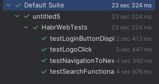
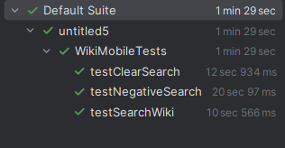

# Итоговый проект

Итоговый проект курса. Автоматизированное тестирование веб-сайта Habr и Android-приложения Wikipedia.

## 🛠 Стек технологий
* **Java 22**
* **Maven** (управление зависимостями)
* **TestNG** (запуск тестов и ассерты)
* **Selenium WebDriver 4.27** (Web)
* **Appium Java Client 9.3.0** (Mobile)
* **Паттерн:** Page Object Model (POM)

---

## 📂 Структура проекта
* `src/test/java/com/example/pages` — Page Objects (описание страниц и элементов).
* `src/test/java/com/example/tests` — Сами тесты (Assertions).
* `src/test/java/com/example/utils` — Настройка драйверов (BaseTest).
* `src/resources/wiki.apk` — Файл приложения.

---

## 🌍 Часть 1. Веб-тесты (Habr.com)
**Сценарии (4 теста):**
1.  **Поиск:** Ввод запроса "DevOps" и проверка результатов.
2.  **Навигация:** Переход в раздел "Новости".
3.  **Логотип:** Возврат на главную страницу через клик по лого.
4.  **UI:** Проверка отображения кнопки "Войти".

**Запуск Web-тестов:**
```bash
mvn clean test -DsuiteXmlFile=testng.xml
```

## 📱 Часть 2. Мобильные тесты (Wikipedia Android)

### Тесты запускаются на эмуляторе Android (без необходимости доступа в интернет).

**Требования:**

* Установлен Appium Server (npm i -g appium).

* Установлен драйвер UiAutomator2 (appium driver install uiautomator2).

* Настроена переменная ANDROID_HOME.

* Запущен Эмулятор (Pixel 7, API 33 recommended).

### Сценарии (3 теста):

1. Позитивный поиск: Пропуск Onboarding, поиск "Java", проверка наличия результатов.

2. Негативный поиск: Ввод несуществующего запроса, проверка отсутствия результатов (пустой список).

3. Интерфейс: Ввод текста и очистка поля поиска кнопкой "Х".

### Запуск Mobile-тестов:

Запустите Appium Server в терминале:

```Bash
appium
```

Запустите класс 
```Bash
src/test/java/com/example/tests/mobile/WikiMobileTests.java через IntelliJ IDEA.
```

🏆 Результаты
Проект полностью соответствует критериям оценки:

✅ Реализовано 4 веб-сценария 


✅ Реализовано 3 мобильных сценария.


✅ Тесты стабильны (используются явные ожидания WebDriverWait).

✅ Код структурирован по Page Object Model.

✅ Настроена гибкая конфигурация (appWaitActivity) для стабильного запуска на эмуляторах.